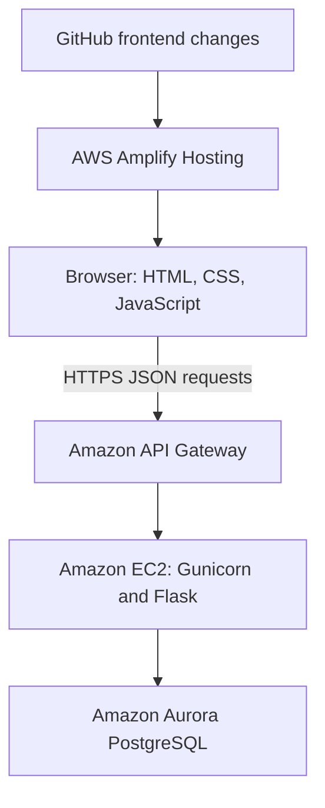

# Stock Trading Simulator

A three-person Arizona State University IT capstone exploring how a browser-based trading simulator can be built and deployed across AWS services. Users manage simulated cash, buy and sell shares, and review their holdings and transactions. Administrators manage stocks and market schedules.

**Academic simulation:** no real brokerage orders or real-money trading.

## Project and my role

I’m Matthew Camacho, the team lead for this 15-week ASU capstone. My work included leading the team, contributing to application integration and troubleshooting, and working across the frontend, Flask API, and AWS deployment. This was a shared team project; the application includes contributions from all three members.

The project gave me practical experience connecting a static frontend to a separately hosted API and relational database, troubleshooting requests across service boundaries, and coordinating work across application components. Repository history and source files preserve team contributions; commit counts alone do not capture backend work deployed separately to EC2.

## Capstone architecture

The following describes the capstone deployment, as reported by the project lead. The repository does not contain a complete infrastructure definition or establish whether those services are currently running.

| Component | Responsibility |
| --- | --- |
| HTML, CSS, JavaScript | Forms, navigation, portfolio displays, charts, and API requests |
| AWS Amplify | Hosted the static frontend and deployed frontend changes from GitHub |
| Amazon API Gateway | Provided the frontend-facing HTTPS API endpoint and forwarded requests to the backend |
| Amazon EC2 | Ran the Python Flask API through Gunicorn; systemd managed the backend service |
| Aurora PostgreSQL | Stored users, balances, stocks, positions, transactions, and market configuration |

GitHub primarily supported the **frontend deployment workflow**. The backend ran separately on EC2, so a committed backend snapshot is not necessarily the final deployed backend.

## Features

| Area | Capabilities represented in the source |
| --- | --- |
| Accounts | Registration, password login, bearer tokens, and user/admin roles |
| Simulated cash | Deposits, withdrawals, and balance display |
| Trading | Buy and sell orders, holdings checks, and market-hours enforcement |
| Portfolio | Holdings, current portfolio value, cash balance, and total equity |
| Transactions | Trade and cash-movement history with type/ticker filtering |
| Administration | Stock creation/updates, market hours, weekend-trading configuration, and date-specific closure/special-hours routes |
| Market display | Stock prices, share counts, calculated market capitalization, and charts |
| Price simulation | Price-update logic with a 15-minute eligibility interval and simulated historical chart data |

Chart data is educational: ticker history is generated from current prices, and portfolio history accumulates transaction movements. It should not be interpreted as a real market feed or a complete historical performance calculation.

## Code guide

| Path | Contents |
| --- | --- |
| [`frontend/Trading_System/index.html`](frontend/Trading_System/index.html) | Market overview |
| [`frontend/Trading_System/pages/`](frontend/Trading_System/pages/) | Account, trading, portfolio, and admin pages; also contains earlier variants |
| [`frontend/Trading_System/javascript/api.js`](frontend/Trading_System/javascript/api.js) | Shared API requests and browser token handling |
| [`backend/app.py`](backend/app.py) | Final capstone backend supplied and identified by the project lead |
| [`backend/`](backend/) | Backend snapshots, supporting code, requirements, and a health test |
| [`.github/workflows/ci.yml`](.github/workflows/ci.yml) | Initial GitHub Actions checks; not an EC2 backend deployment pipeline |
| [`docs/REPOSITORY_REVIEW.md`](docs/REPOSITORY_REVIEW.md) | Backend comparison, known limitations, and prioritized cleanup work |

## Authentication design

Registration hashes passwords using Werkzeug before storing them in PostgreSQL. Login checks the stored hash and issues a signed HS256 JWT with a one-hour lifetime. The browser stores the token in `localStorage` and sends it in an `Authorization: Bearer` header. Protected routes retrieve the user from the database, and admin routes check the database role.

The retained development code includes a legacy username-token fallback and a development signing-secret default that require removal before reuse. See the [review](docs/REPOSITORY_REVIEW.md) for details. This snapshot is not presented as production-ready authentication.

## Repository status and reproduction

This repository is being reconciled into an accurate capstone portfolio record. The project lead identified the separately retained `SRE_Stock_Sim_Current` file as the final backend used to run the capstone. It is restored here as `backend/app.py`, with line endings normalized. It passes syntax parsing; this is not an end-to-end runtime verification. The earlier committed snapshot and its syntax errors remain traceable in Git history. See the [comparison](docs/REPOSITORY_REVIEW.md) for the differences and remaining risks.

A working backend setup also needs a verified database schema, complete runtime dependencies, environment configuration, and integration testing. The current requirements omit PyJWT and Gunicorn; the repository does not include a complete database bootstrap or the deployed systemd/API Gateway configuration. Consequently, this README does not claim that a fresh clone runs end to end.

The source reads `DATABASE_HOST`, `DATABASE_PORT`, `DATABASE_NAME`, `DATABASE_USER`, `DATABASE_PASSWORD`, `JWT_SECRET`, and `AMPLIFY_ORIGIN`; direct Flask startup also reads `PORT`. Deployment-specific values and secrets belong outside Git. The frontend API URL is configured in `api.js` and several pages and must be reviewed before any future deployment.

## Separate follow-on project

My newer [stock-trading-sre-platform](https://github.com/mcamac38/stock-trading-sre-platform) is a separate project for further reliability and operations practice. Its infrastructure and automation work should not be attributed to this capstone. This repository documents the original Amplify / API Gateway / EC2 / Aurora application.
