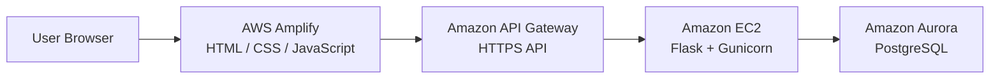

# Stock Trading Simulator

A full-stack, AWS-hosted stock trading simulation platform developed as an Arizona State University Information Technology capstone project.

The application allows users to create accounts, manage simulated funds, buy and sell stocks, track portfolio holdings, and review transaction activity. Administrative features provide control over tradable stocks, normal market hours, and date-specific market closures or special trading schedules.

The project combines a browser-based frontend, REST API, authentication and authorization, relational database design, transaction processing, and multiple AWS services into a distributed cloud application.

---

## Architecture



### Application Flow

1. The user interacts with the frontend hosted through AWS Amplify.
2. JavaScript sends REST API requests through Amazon API Gateway.
3. API Gateway forwards requests to the Python Flask application running on Amazon EC2.
4. Flask authenticates the request, performs application logic, and communicates with PostgreSQL.
5. Amazon Aurora stores persistent user, stock, portfolio, transaction, and market configuration data.
6. JSON responses are returned to the frontend and rendered for the user.

---

## Key Features

### Authentication and User Accounts

Users can register and log in using individual simulator accounts.

The application uses:

- Password hashing before credentials are stored
- JSON Web Tokens (JWT) for authenticated sessions
- Bearer-token authentication for protected API requests
- User and administrator roles
- Server-side authorization for administrative operations

After authentication, protected frontend requests include the user's token in the HTTP authorization header.

```text
Authorization: Bearer <token>
```

The backend validates the token and retrieves the associated user before allowing access to protected operations.

---

### Simulated Trading

Authenticated users can buy and sell stocks using simulated account funds.

The trading workflow includes validation for:

- Authentication
- Stock availability
- Order quantity
- Available account balance
- Shares owned when selling
- Current market status

Successful trades update the associated account balance, portfolio position, and transaction history.

When additional shares of an existing stock are purchased, the application recalculates the position's average cost.

---

### Portfolio Tracking

Users can view their simulated investment portfolio, including information such as:

- Available cash
- Owned stocks
- Number of shares
- Current stock prices
- Position values
- Overall portfolio value

Portfolio records are associated with the authenticated user so account data remains separated between users.

---

### Deposits and Withdrawals

Users can add or remove simulated funds from their accounts.

The backend validates transaction amounts before modifying the account balance and prevents withdrawals that would reduce the balance below zero.

---

### Transaction History

The application records account activity so users can review previous actions such as:

- Stock purchases
- Stock sales
- Deposits
- Withdrawals

This provides a historical record of activity performed within the simulator.

---

### Dynamic Market Hours

Trades are controlled by server-side market scheduling rules.

Administrators can configure:

- Market opening time
- Market closing time
- Market time zone

Before executing a trade, the backend determines the current time in the configured market time zone and checks whether trading is currently permitted.

Orders submitted while the simulated market is closed are rejected.

---

### Market Schedule Overrides

The application also supports date-specific exceptions to normal trading hours.

Administrators can configure a date as:

- Closed for the entire day
- Open using special hours
- Associated with a note describing the schedule change

These records allow the simulator to represent holidays, special closures, and shortened trading days.

Date-specific rules take priority over the normal daily market schedule.

---

### Administrative Controls

Administrator accounts have access to additional market-management functionality.

Administrative features include:

- Creating and configuring stocks
- Updating normal market hours
- Setting the market time zone
- Creating market closures
- Configuring special trading schedules

Authorization is enforced by the backend so hiding administrative controls in the frontend is not the application's only security mechanism.

---

## Technology Stack

| Layer | Technology |
|---|---|
| Frontend | HTML5, CSS3, JavaScript |
| Frontend Hosting | AWS Amplify |
| API Layer | Amazon API Gateway |
| Backend | Python, Flask |
| Application Server | Gunicorn |
| Backend Hosting | Amazon EC2 |
| Database | Amazon Aurora PostgreSQL |
| Database Connectivity | psycopg2 |
| Authentication | JSON Web Tokens |
| Password Security | Werkzeug password hashing |
| Authorization | Role-based access control |
| API Style | REST / JSON |
| Version Control | Git / GitHub |
| Cloud Platform | Amazon Web Services |

---

## Authentication Flow

### Registration

```text
Registration Form
       │
       ▼
POST /auth/register
       │
       ▼
Flask Validation
       │
       ▼
Password Hashing
       │
       ▼
PostgreSQL users table
       │
       ▼
JWT Generated
```

Passwords are hashed before being stored in PostgreSQL.

### Login

```text
Username + Password
        │
        ▼
POST /auth/login
        │
        ▼
Retrieve User
        │
        ▼
Verify Password Hash
        │
        ▼
Generate JWT
        │
        ▼
Return Token
```

For protected requests:

```text
Frontend
   │
   │ Authorization: Bearer <JWT>
   ▼
API Gateway
   │
   ▼
Flask
   │
   ├── Validate token
   ├── Identify user
   ├── Determine role
   │
   ▼
Protected Application Logic
```

Administrative operations perform an additional role check and reject authenticated users without administrator privileges.

---

## Database Design

The application uses Amazon Aurora PostgreSQL for persistent application data.

Core tables include:

| Table | Purpose |
|---|---|
| `users` | User identity, authentication information, role, and cash balance |
| `stocks` | Tradable stock information |
| `user_positions` | Stocks currently owned by each user |
| `transactions` | Trading activity |
| `cash_transactions` | Deposit and withdrawal activity |
| `market_hours` | Standard market operating configuration |
| `market_schedule_closures` | Date-specific closures and special schedules |

A simplified relationship model is:

```text
users
  │
  ├──── user_positions ──── stocks
  │
  ├──── transactions
  │
  └──── cash_transactions

market_hours

market_schedule_closures
```

### Position Updates

When a user purchases additional shares of a stock already in the portfolio, the existing position is updated instead of creating an unrelated duplicate holding.

The average cost is recalculated using the existing and newly purchased shares:

```text
Average Cost =
(
    Existing Quantity × Existing Average Cost
    +
    Purchased Quantity × Purchase Price
)
÷
Total Quantity
```

---

## Trading Transaction Flow

A stock purchase involves multiple related operations.

```text
Buy Request
    │
    ▼
Authenticate User
    │
    ▼
Check Market Status
    │
    ▼
Validate Stock + Quantity
    │
    ▼
Retrieve Current Price
    │
    ▼
Calculate Order Value
    │
    ▼
Verify Available Cash
    │
    ▼
Update Cash Balance
    │
    ▼
Create / Update Position
    │
    ▼
Record Transaction
    │
    ▼
Return Updated Account Data
```

The balance update includes a database-level condition preventing a purchase from reducing the user's cash balance below zero.

This helps keep account balances, portfolio positions, and transaction records consistent during order processing.

---

## Market Scheduling Logic

Market availability is determined by the backend rather than relying on the user's browser clock.

```text
Current UTC Time
       │
       ▼
Load Market Configuration
       │
       ▼
Convert to Configured Time Zone
       │
       ▼
Check Date-Specific Schedule
       │
       ├── Full-Day Closure
       │
       ├── Special Hours
       │
       └── No Override
       │
       ▼
Determine Effective Hours
       │
       ▼
Compare Current Time
       │
       ▼
   OPEN / CLOSED
```

Because market rules are enforced by the backend, modifying frontend JavaScript does not bypass the trading-hour restriction.

---

## AWS Deployment

### AWS Amplify

The HTML, CSS, and JavaScript frontend was hosted through AWS Amplify.

During development, the frontend source was maintained in GitHub and used by Amplify to deploy application changes.

### Amazon API Gateway

API Gateway provides the HTTPS interface between the browser-based frontend and the Flask backend.

```text
AWS Amplify
     │
     │ HTTPS
     ▼
API Gateway
     │
     ▼
EC2
```

This architecture separates the publicly accessible frontend from the application server.

### Amazon EC2

The Flask backend was hosted on an Amazon EC2 instance.

Gunicorn served the Flask application in the deployed environment, with the application running as a managed service on the EC2 host.

### Amazon Aurora PostgreSQL

Aurora PostgreSQL provides persistent relational storage for application data including accounts, market data, positions, transactions, and administrative market configuration.

Database connection information is supplied to the backend through environment configuration rather than being embedded directly into database queries.

---

## Engineering Challenges

### Integrating Multiple AWS Services

The frontend, API, backend, and database operated as separate components:

```text
Browser
   ↓
AWS Amplify
   ↓
Amazon API Gateway
   ↓
Amazon EC2
   ↓
Aurora PostgreSQL
```

Building the application required troubleshooting communication across each layer, including API paths, HTTP/HTTPS configuration, CORS behavior, authentication headers, backend routing, and database operations.

### Maintaining Consistent Trading Data

A single trade can affect several pieces of application state.

For example, a purchase may modify:

- Cash balance
- Share quantity
- Average cost
- Transaction history

These related operations required careful backend and database logic so failed or invalid orders would not leave account data in an inconsistent state.

### Authentication Across Separately Hosted Components

The static frontend and Flask backend are hosted separately.

JWT bearer authentication allowed user identity to travel with API requests while keeping authentication and authorization decisions on the backend.

### Configurable Market Rules

The original concept of market hours expanded into a system supporting:

```text
Standard Hours
      +
Time Zone
      +
Specific-Date Closures
      +
Special Trading Hours
      =
Effective Market Schedule
```

This required coordinating administrator configuration, PostgreSQL records, time-zone handling, API responses, and trade enforcement.

---

## Project Context

The Stock Trading Simulator was developed as a **15-week team capstone project** for Arizona State University's Information Technology program.

The project progressed through planning, requirements analysis, system design, development, integration, testing, troubleshooting, documentation, and final demonstration.

The completed application provided hands-on experience integrating:

- Frontend development
- REST API development
- Python backend programming
- PostgreSQL database design
- Authentication and authorization
- Transaction processing
- AWS cloud services
- Distributed application troubleshooting
- Git-based source control
- Technical documentation

---

## Future Improvements

Potential improvements include:

- Automated unit and integration testing
- CI/CD pipelines
- Infrastructure as Code
- Containerized deployment
- Centralized application logging
- Cloud monitoring and alerting
- Automated database migrations
- AWS-managed secrets storage
- Historical portfolio charts
- Expanded stock-price simulation
- Additional order types
- Improved session and token management

---

## Educational Use

This project is a stock market simulation created for educational and portfolio purposes.

It does **not** execute real financial transactions, connect to brokerage accounts, provide financial advice, or use real funds.